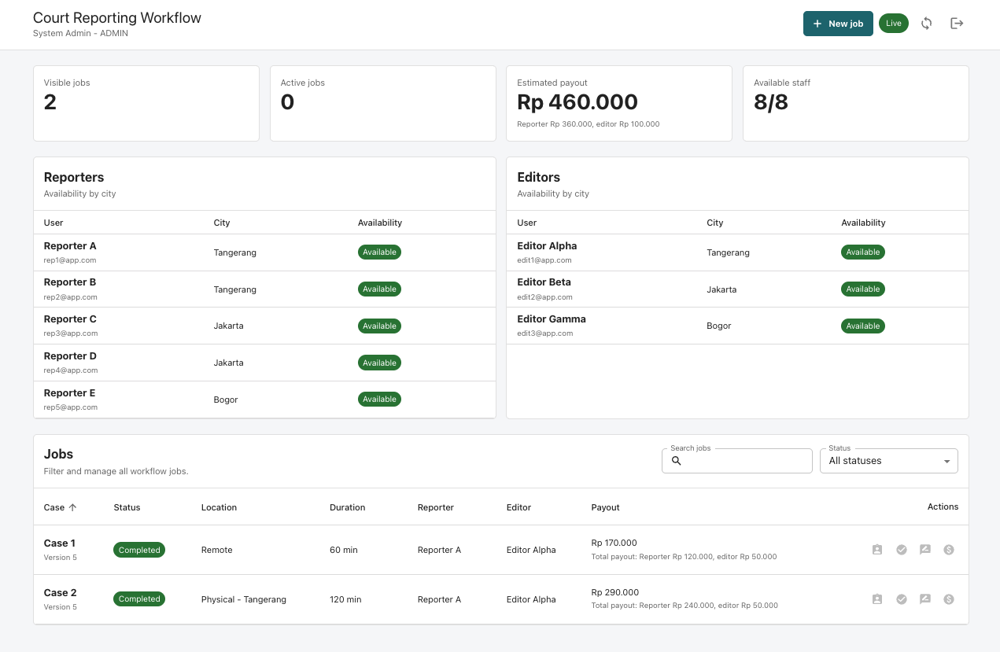
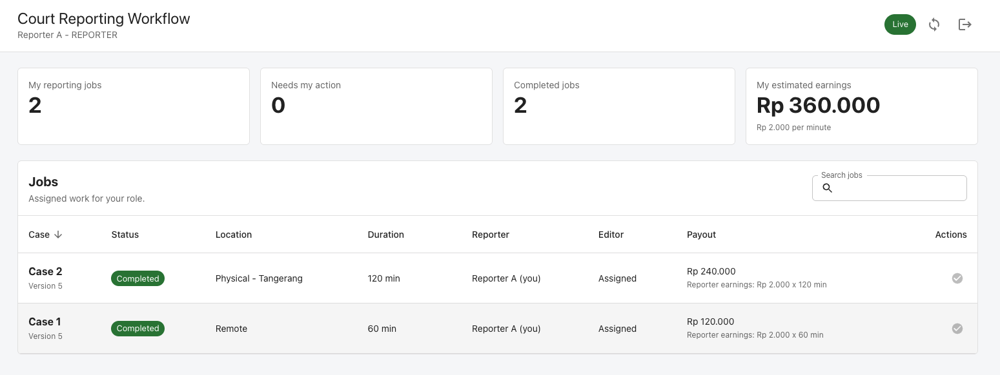
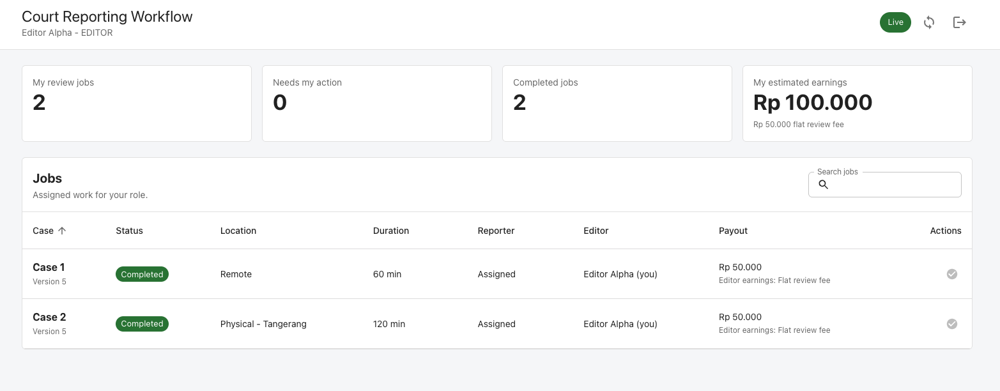

# VoiceScript Tech Assignment

Court Reporting Workflow Manager for managing transcription jobs, reporter/editor assignments, status tracking, realtime updates, and payout calculation.

## Demo Media

The GIF below shows the role-based dashboard, assignment flow, status updates, and realtime refresh behavior.


If the GIF does not load in your Markdown preview, open the source video directly:

[Watch the workflow demo video](docs/demo/workflow-demo.mov)

Screenshots:

| Admin Dashboard | Reporter Dashboard | Editor Dashboard |
| --- | --- | --- |
|  |  |  |

## Project Structure

```text
court-reporting-workflow/
  server/   Node.js + TypeScript + Express + PostgreSQL
  client/   Next.js + TypeScript + Material UI + TanStack Query
```

## Workflow

The core job flow is:

```text
NEW -> ASSIGNED -> TRANSCRIBED -> IN_REVIEW -> REVIEWED -> COMPLETED
```

The assessment lists `NEW -> ASSIGNED -> TRANSCRIBED -> REVIEWED -> COMPLETED`. This implementation adds `IN_REVIEW` as an explicit review-tracking state after an editor is assigned. That makes the editor workflow visible instead of hiding the review step.

## Roles

Admin:

- Creates jobs.
- Assigns reporters to `NEW` jobs.
- Assigns editors after transcription.
- Processes payment after review.
- Sees reporter/editor availability.

Reporter:

- Sees only jobs assigned to them.
- Marks assigned jobs as `TRANSCRIBED`.
- Becomes available again after transcription is submitted.
- Sees per-job reporter earnings.

Editor:

- Sees only review jobs assigned to them.
- Marks review jobs as `REVIEWED`.
- Becomes available again after review is submitted.
- Sees per-job editor earnings.

## Assignment Rules

Reporter assignment:

- Reporters have name, city, role, and availability.
- Physical jobs include a city.
- Same-city reporters are preferred and listed first.
- Remote assignment is still allowed, so admin can assign any available reporter.

Concurrency protection:

- Job updates use optimistic versioning.
- Assignment also atomically claims the reporter/editor availability row.
- This prevents two admins from assigning the same job or same staff member at the same time.

## Payment Rules

Reporter payout:

```text
duration_minutes x 2000 IDR
```

Editor payout:

```text
50000 IDR flat fee per reviewed job
```

Admin sees total payout per job. Reporter/editor users see their own per-job earnings.

## Realtime Updates

The backend emits Socket.IO `jobUpdated` events when jobs are assigned, statuses change, or payments complete.

The frontend listens for those events and invalidates TanStack Query caches for jobs and staff. The dashboard shows a realtime status chip:

- `Live`: connected
- `Connecting`: reconnecting
- `Idle`: disconnected after 5 minutes of inactivity
- `Refresh required`: reconnect failed after 3 attempts
- `Offline`: not connected

## Running The Backend

```bash
cd court-reporting-workflow/server
npm install
cp .env.example .env
npx prisma generate
npx prisma migrate deploy
npm run db:seed
npm run dev
```

The API runs on:

```text
http://localhost:3004
```

## Running The Frontend

```bash
cd court-reporting-workflow/client
npm install
cp .env.example .env.local
npm run dev
```

The client runs on:

```text
http://localhost:3000
```

Default API URL:

```text
NEXT_PUBLIC_API_BASE_URL=http://localhost:3004/api
```

## Seeded Login Accounts

All seeded accounts use:

```text
password123
```

Admin:

```text
admin@app.com
```

Reporters:

```text
rep1@app.com
rep2@app.com
rep3@app.com
rep4@app.com
rep5@app.com
```

Editors:

```text
edit1@app.com
edit2@app.com
edit3@app.com
```

To test multiple roles at once, use separate browsers or separate Chrome profiles. `localStorage` is shared by tabs in the same browser profile.

## Tests

Backend:

```bash
cd court-reporting-workflow/server
npm test
```

The tests cover:

- Atomic reporter/editor claiming.
- Version-guarded reporter assignment.
- Version-guarded editor assignment.
- Failure behavior when staff is already claimed.

## Build Checks

Backend:

```bash
cd court-reporting-workflow/server
npm run build
```

Frontend:

```bash
cd court-reporting-workflow/client
npm run build
```
